## Hi there 👋

<!--
**EliCJonas/EliCJonas** is a ✨ _special_ ✨ repository because its `README.md` (this file) appears on your GitHub profile.

Here are some ideas to get you started:

- 🔭 I’m currently working on auro, my package manager.
- 🌱 I’m currently learning nothing really.
- 👯 I’m looking to collaborate on packages for auro.
- 🤔 I’m looking for help with anything really.
- 💬 Ask me about Auro. XD
- 📫 How to reach me: Leave an issue on any of my repositories, or ping me on Newnet IRC at ecjonas.
- 😄 Pronouns: he/him
- ⚡ Fun fact: I have Claude Pro.
-->
- 🔭 I’m currently working on auro, my package manager.
- 🌱 I’m currently learning nothing really.
- 👯 I’m looking to collaborate on packages for auro.
- 🤔 I’m looking for help with anything really.
- 💬 Ask me about Auro. XD
- 📫 How to reach me: Leave an issue on any of my repositories.
- 😄 Pronouns: he/him
- ⚡ Fun fact: I have Claude Pro.
- 

